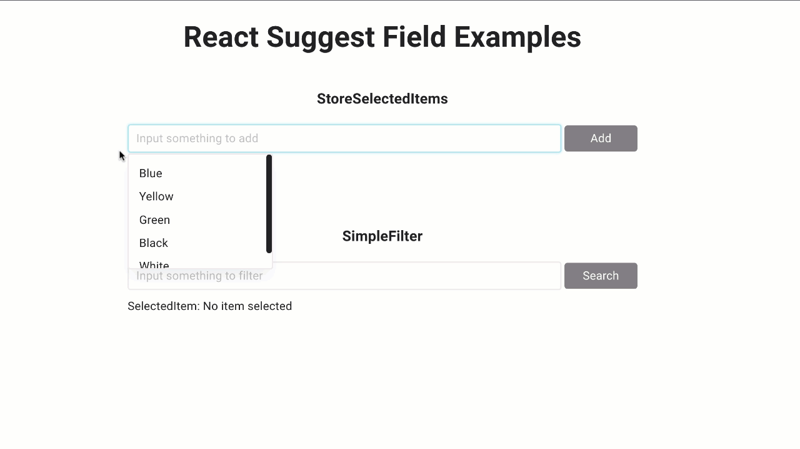

# React Suggest Field



## About the Project

This is a npm package to help you develop an auto-complete suggest field.
You can try it out on this [live storybook demo](https://yocosaka-react-suggest-field.netlify.app/)!

## Built With

- TypeScript
- React
- SCSS
- Rollup

## Live Demo

[Live Demo Link](https://yocosaka-react-suggest-field.netlify.app/)

## Installation

```
$ npm install react-suggest-field
$ yarn add react-suggest-field
```
## Types & Props

### Types

| Type  | Detail           |
| ----------------- | ---------------------------------------------------------------------------- |
| ItemType          | { id: IdType, label: string }|
| IdType| string / number / null / undefined       |
| ErrorMessagesType | { maximumReached:string, alreadyAdded:string, unavailableCharacters:string } |

### Props in SimpleFilter

| Props | Optional | Types    | Default Value |
| ----------------- | -------- | -------------------------------- | ------------- |
| originSuggestions | required | ItemType[]           | []|
| onClick           | required | (selectedItem: ItemType) => void | - |
| btnLabel          | optional | string   | 'Search'      |
| placeholder       | optional | string   | - |
| className         | optional | string   | - |

### Props in StoreSelectedItems

| Props | Optional | Types        | Default Value  |
| ----------------- | -------- | ------------------------------------------------ | -------------------------------------------------------------------------------------------------------------------------------------------------------------------------------------- |
| items | required | state: ItemType[]        | -  |
| setItems          | required | React.Dispatch<React.SetStateAction<ItemType[]>> | -  |
| originSuggestions | required | ItemType[]   | -  |
| inputRegexStr?    | optional | string       | /[A-Za-z0-9\s]/|
| btnLabel          | optional | string       | 'Add'          |
| className         | optional | string       | -  |
| maxItemLength     | optional | number       | -  |
| placeholder       | optional | string       | -  |
| error | required | state: string| -  |
| setError          | required | React.Dispatch<React.SetStateAction<string>>     | -  |
| showErrorMessage  | optional | boolean      | true |
| errorMessages     | optional | ErrorMessagesType        | maximumReached: 'Unable to add a new item as it reached 3 items.', alreadyAdded: 'This item is already added.', unavailableCharacters: 'Sorry... Only letters, numbers are available.' |

### Props in SimpleFilter

| Props | Optional | Types    | Default Value |
| ----------------- | -------- | -------------------------------- | ------------- |
| children | required | React.Node | -|
| title | optional | string | - |

## The gist

```jsx
import React from 'react';
import { SimpleFilter, StoreSelectedItems, ItemType, CompContainer, ErrorMessagesType } from 'react-suggest-field';
import 'react-suggest-field/dist/bundle.css';

  const originSuggestions = [
  {
    id: 1,
    label: 'Red',
  },
  {
    id: 2,
    label: 'Blue',
  },
  {
    id: 3,
    label: 'Yellow',
  },
  {
    id: 4,
    label: 'Green',
  },
  {
    id: 5,
    label: 'Black',
  },
  {
    id: 6,
    label: 'White',
  },
];

const initialItems = [
  {
    id: 7,
    label: 'Rainbow',
  },
];

const maxItemLength = 3

const myErrorMessages: ErrorMessagesType = {
  maximumReached: `Unable to add a new item as it reached ${maxItemLength} items.`,
  alreadyAdded: 'This item is already added.',
  unavailableCharacters: 'Sorry... Only letters, numbers are available.',
};

function App() {

  const [items, setItems] = useState<ItemType[]>(initialItems)
  const [error, setError] = useState<string>('')

  return (
    <>
      <CompContainer title={'Store Selected Items'}>
        <StoreSelectedItems
          items={items}
          setItems={setItems}
          error={error}
          setError={setError}
          originSuggestions={originSuggestions}
          btnLabel={'Add'}
          className={'wonderful-class'}
          maxItemLength={maxItemLength}
          placeholder="Input something to add"
          errorMessages={myErrorMessages}
          showErrorMessage={true}
        />
      </CompContainer>
      <CompContainer title={'Simple Filter'}>
        <SimpleFilter
          originSuggestions={originSuggestions}
          placeholder="Input something to filter"
          onClick={(selectedItem) => alert(`${selectedItem.label} is inputted!`)}
          btnLabel={'Search!'}
          className={'wonderful-class'}
        />
      </CompContainer>
    </>
  );
}

export default App;
```

## Author

👤 **Yoko Saka**

- GitHub: [@yocosaka](https://github.com/yocosaka)
- LinkedIn: [Yoko Saka](https://www.linkedin.com/in/yokosaka)

## Contributions

### Code Contributions

Contributions, issues, and feature requests are welcome!
Feel free to check the [issues page](../../issues).

1. Fork the Project
2. Create your Feature Branch (`git checkout -b feature/AmazingFeature`)
3. Commit your Changes (`git commit -m 'Add some AmazingFeature'`)
4. Push to the Branch (`git push origin feature/AmazingFeature`)
5. Open a Pull Request


<!-- ### Financial Contributors -->


## Show your support

Give a ⭐️ if you like this project!

## License

This project is [MIT](./LICENSE) licensed.

## Acknowledgements

- [npmjs](https://www.npmjs.com/)
- [Storybook](https://storybook.js.org/)
- [Rollup](https://rollupjs.org/)
